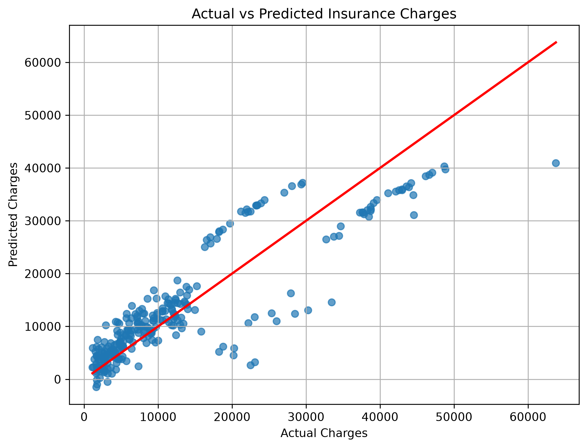

# Medical Insurance Cost Prediction using Multiple Linear Regression

---

## Author

**Abhishek Thakur**

Integrated M.Tech in Artificial Intelligence

VIT Bhopal University

---

## Project Overview

This project implements a **Multiple Linear Regression** model to predict medical insurance charges based on customer information. The model is trained using the Medical Cost Personal Insurance dataset and evaluated using standard regression metrics.

---

## Objective

The objective of this project is to develop a Multiple Linear Regression model that predicts medical insurance charges using the following features:

- Age
- Sex
- BMI
- Number of Children
- Smoker
- Region

The target variable is:

- Insurance Charges

---

## Dataset

**Dataset Name:** Medical Cost Personal Insurance Dataset

**Source:** https://www.kaggle.com/datasets/mirichoi0218/insurance

> **Note:** The dataset is intentionally excluded from this repository as per the assignment instructions.

---

## Technologies Used

- Python
- Pandas
- NumPy
- Matplotlib
- Scikit-learn
- Jupyter Notebook

---

## Project Structure

```text
assignment-1/
│
├── Assignment-1.ipynb
├── Assignment-1.py
├── README.md
├── requirements.txt
├── .gitignore
│
├── images/
│   └── actual_vs_predicted.png
│
└── dataset/
    └── insurance.csv (Not included in GitHub)
```

---

## Methodology

1. Load the dataset.
2. Perform data understanding.
3. Check for missing values.
4. Encode categorical variables using Label Encoding.
5. Split the dataset into training and testing sets (80:20).
6. Train a Multiple Linear Regression model.
7. Predict insurance charges.
8. Evaluate the model using MAE, MSE, and R² Score.
9. Visualize the results using an Actual vs Predicted scatter plot.

---

## Model Performance

The Multiple Linear Regression model was evaluated using standard regression metrics.

| Metric | Value |
|--------|------:|
| Mean Absolute Error (MAE) | 4186.51 |
| Mean Squared Error (MSE) | 33635210.43 |
| R² Score | 0.7833 |

### Actual vs Predicted Scatter Plot

The figure below compares the actual insurance charges with the values predicted by the Multiple Linear Regression model.



---

## Conclusion

The Multiple Linear Regression model successfully predicts medical insurance charges using customer information. The model achieved an **R² Score of 0.7833**, indicating that it explains approximately **78.33%** of the variation in insurance charges. Although the model performs well, it assumes a linear relationship between the input features and the target variable, which may limit its ability to capture complex real-world patterns.

---

## How to Run

Clone the repository:

```bash
git clone git@github.com:Abthakur-hub/assignment-1.git
```

Move into the project directory:

```bash
cd assignment-1
```

Install the required dependencies:

```bash
pip install -r requirements.txt
```

Run the Python script:

```bash
python Assignment-1.py
```

Or open and execute all cells in:

```text
Assignment-1.ipynb
```

---

